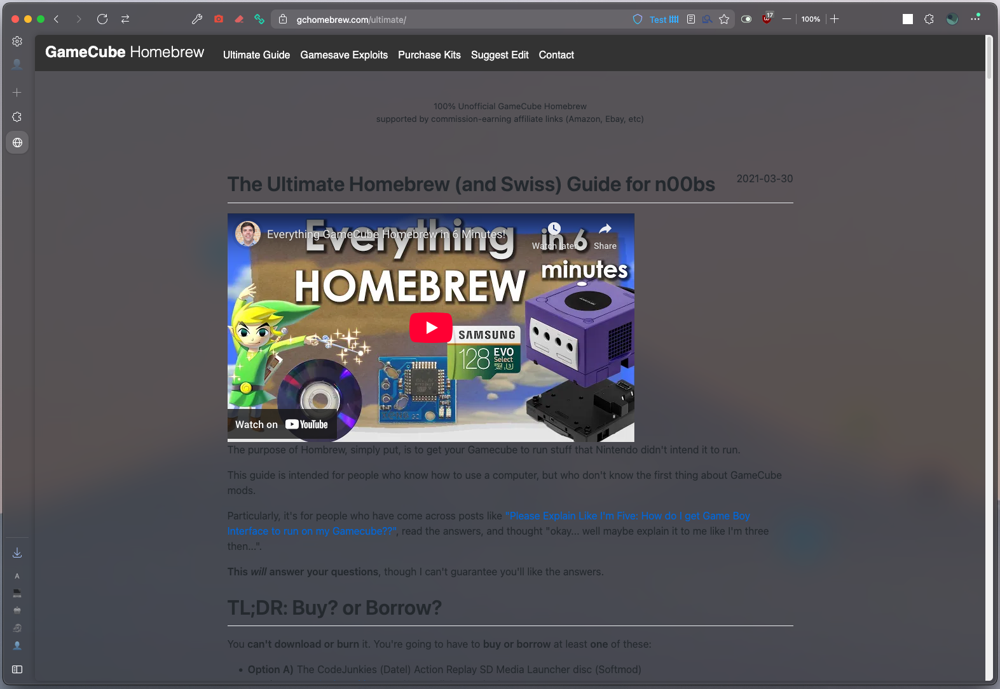
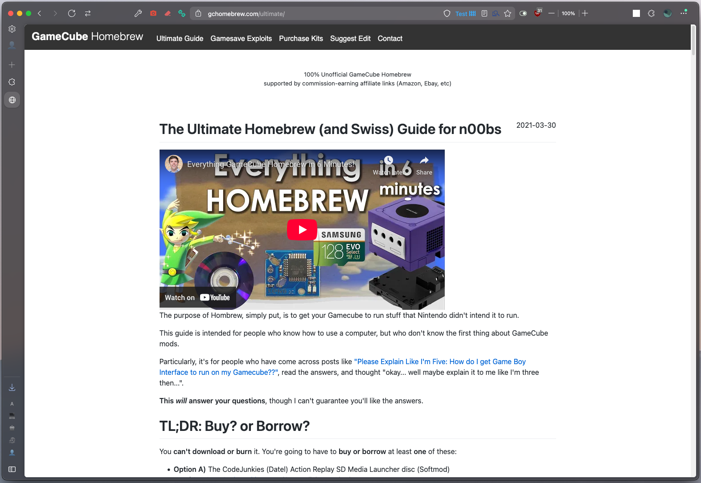
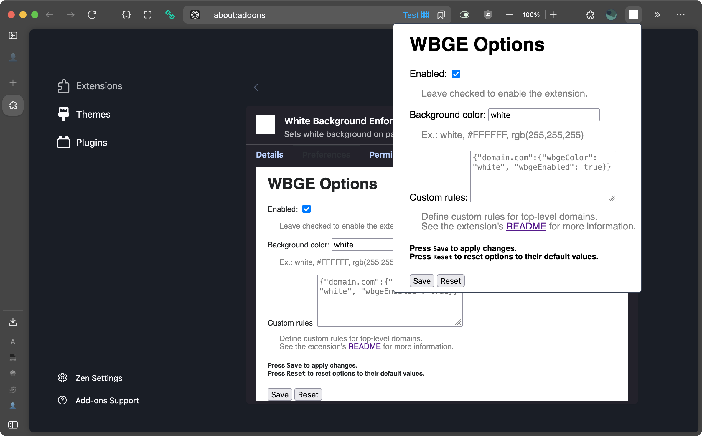

<h3 align="center" >
  <!--
  github color: brightgreen
  label color: #505050
  mastodon color: #6364FF
  mozilla color: #6e008b
  box color: #F0F0F0
  -->

  

    
    
  

  <h3 align="center">
    <code>White Background Enforcer</code>
  </h3>
  
  <h6 align="center">
    by <a href="https://nickesc.github.io">N. Escobar</a> / <a href="https://github.com/nickesc">nickesc</a>
      
    
  </h6>
  <h6 align="center">
    a browser extension that sets a white background
    on pages where <code>background-color</code> is not explicitly set
  </h6>
  

    
  

</h3>

## Overview
`White Background Enforcer` (`WBGE`) is a small, open-source browser extension – made especially for [Zen browser](https://zen-browser.app/) – that enforces (by default) a white background on transparent pages and pages that do not have a `background-color` set.

Without `WBGE` | With `WBGE`
-|-
|

## Options

The extension can be disabled and the color of the background can be changed using the extension's Toolbar Button or the extension's `Preferences` tab in `Add-on Manager (about:addons)` > `Extensions` > `White Background Enforcer`

## Privacy

`WBGE` does not collect or track any data.

## License

`WBGE` is licensed under `The MIT License`. For more information, view the repository's [`LICENSE`](LICENSE) file.
